# Security Hardening and Traffic Analysis

## Harden the OpenWRT System

OpenWRT security was improved by updating the root password, checking how passwords are stored, enabling SSH key login, and switching off an extra service. These actions help protect the router/firewall from unwanted access and reduce possible entry points for attackers.

### Change Default Root Password

The root password was updated with the `passwd` command.

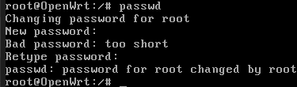

Changing the default password is a basic but important security step because default credentials are easy to guess. A strong password makes unauthorised login more difficult.

### Examine Password Storage

The password file was checked through `/etc/shadow`.

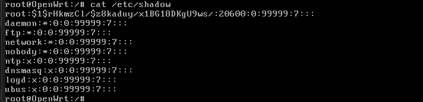

The password was saved as a hash, not as readable text. This is safer because even if someone opens the file, they cannot directly see the real password. They would still need to break the hash.

### Set Up SSH Key-Based Authentication

An SSH key pair was created on the Windows host using the comment `keylab@user`.

The public key was placed inside the OpenWRT Dropbear `authorized_keys` file. After this, SSH login was tested successfully with the private key.

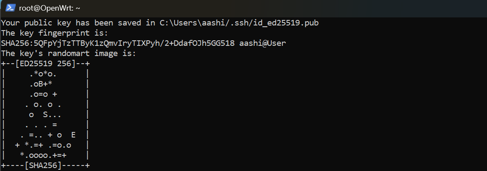

SSH key login is stronger than password-only login because the private key is required. This reduces brute-force password risks.

### Disable Unnecessary Services

The enabled services were reviewed first.

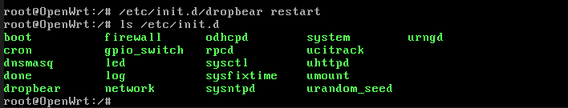

The `rpcd` service was disabled because it was not required for this task.

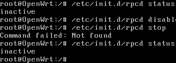

Important services such as `network`, `firewall`, `dropbear`, `uhttpd`, and `dnsmasq` were kept enabled.

## Traffic Analysis

Traffic was captured using `tcpdump` on OpenWRT and checked in Wireshark on Windows.

- [HTTP capture file](./captures/http-capture.pcap)
- [SSH capture file](./captures/ssh-capture.pcap)

### HTTP Traffic Capture

HTTP traffic was captured while opening the test website.

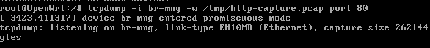

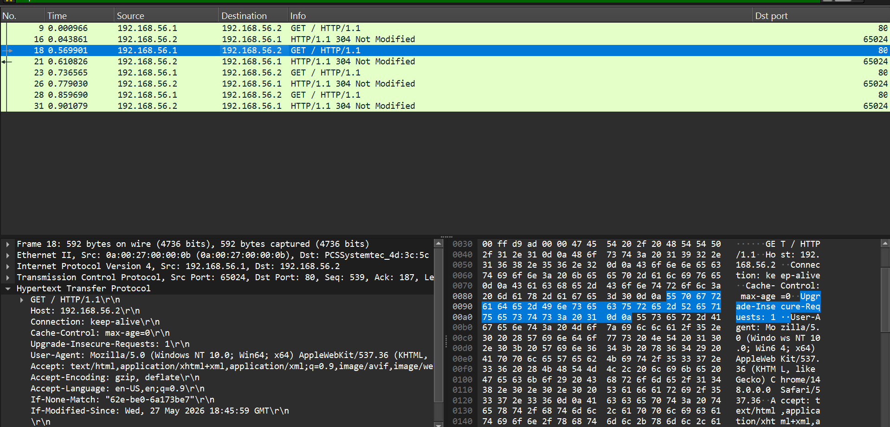

The capture shows `192.168.56.1` sending a `GET / HTTP/1.1` request to `192.168.56.2`.

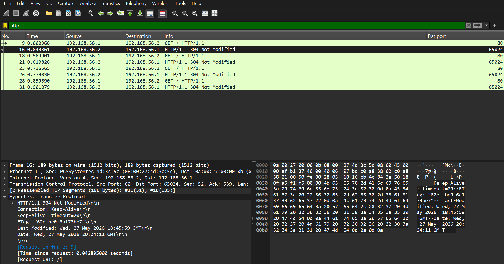

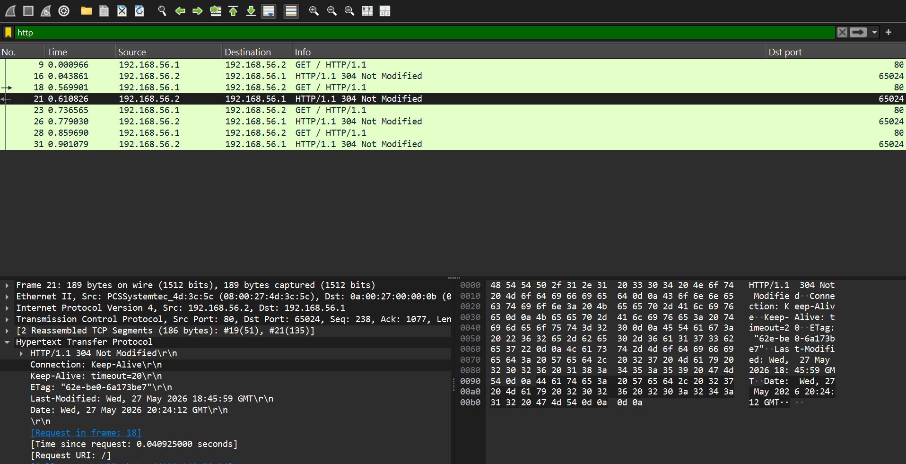

HTTP details are readable in Wireshark, including method, URI, IP addresses, response details, and headers. This creates risk because intercepted HTTP traffic may expose useful information.

### SSH Traffic Capture

SSH traffic was captured during login to OpenWRT.

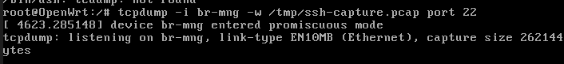

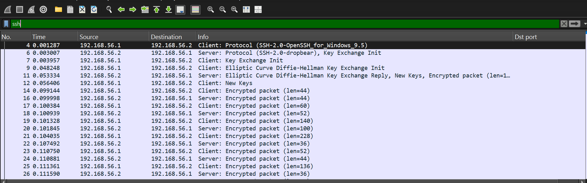

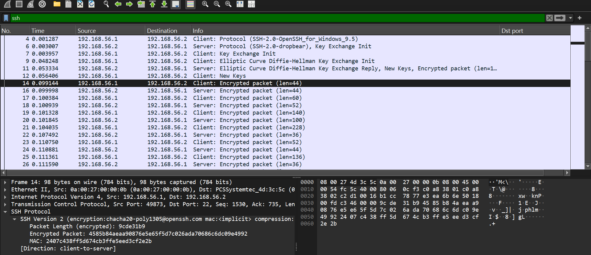

SSH traffic shows packet flow, but the actual commands and session data are encrypted.

### HTTP and SSH Comparison

HTTP is not encrypted, so important request and response details can be viewed. SSH is encrypted, so session content remains protected. Therefore, SSH is safer for managing routers and firewalls.