# Network Setup and Security Testing

## 1. Project Overview

This report is a short description of the OpenWRT and VirtualBox networking configuration for a small accounting and tax consultancy (Harbour Accounting & Tax Solutions) in Sydney, Australia. The lab shows how a small office network can support a fundamental and basic business website with control of HTTP, ICMP, SSH and management services with the ability to set up and apply the rules within the firewall.

| Assumption | Details |
|---|---|
| Business name | Harbour Accounting & Tax Solutions |
| Location | Sydney, Australia |
| Business type | Accounting and tax consultancy |
| Staff size | 8 staff: 1 manager, 4 accounting consultants, 2 admin staff, and 1 part-time IT support officer |
| Website purpose | Business profile, services, contact details, opening hours, and project details |

## 2. OpenWRT and VirtualBox Lab Setup

The practical work was done with OpenWRT in Oracle virtual box. OpenWRT was used as the web server, a light web server (squid), a Linux router/firewall, and an ssh server. The Windows host was used to check access to the OpenWRT management network, connection testing, accessing the hosted website and verifying how the Windows Firewall behaved during test.

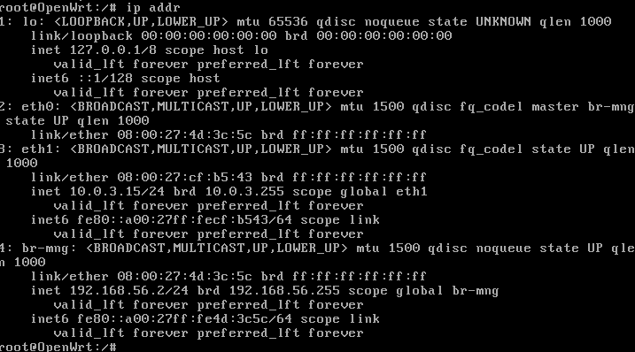

| Interface | IP Address | Purpose |
|---|---|---|
| lo | 127.0.0.1/8 | Local loopback interface |
| eth0 | No direct IP | Member of the management bridge br-mng |
| eth1 | 10.0.3.15/24 | NAT-side interface for external connectivity |
| br-mng | 192.168.56.2/24 | Host-only management bridge used by Windows to reach OpenWRT |

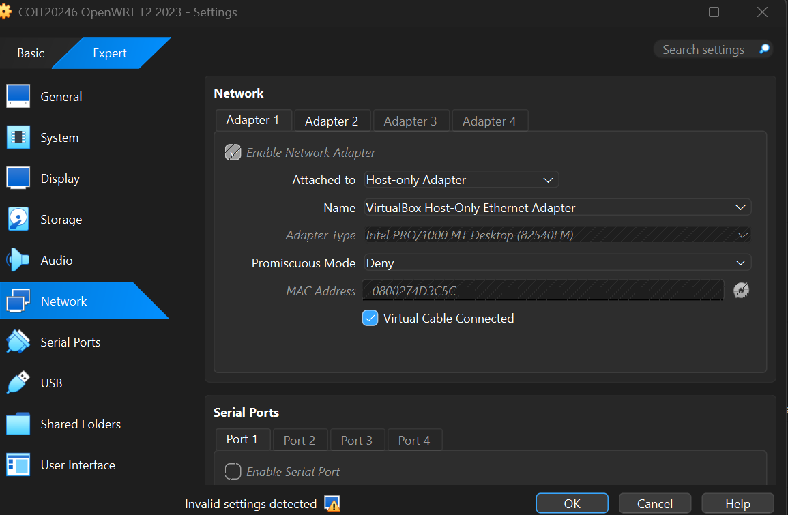

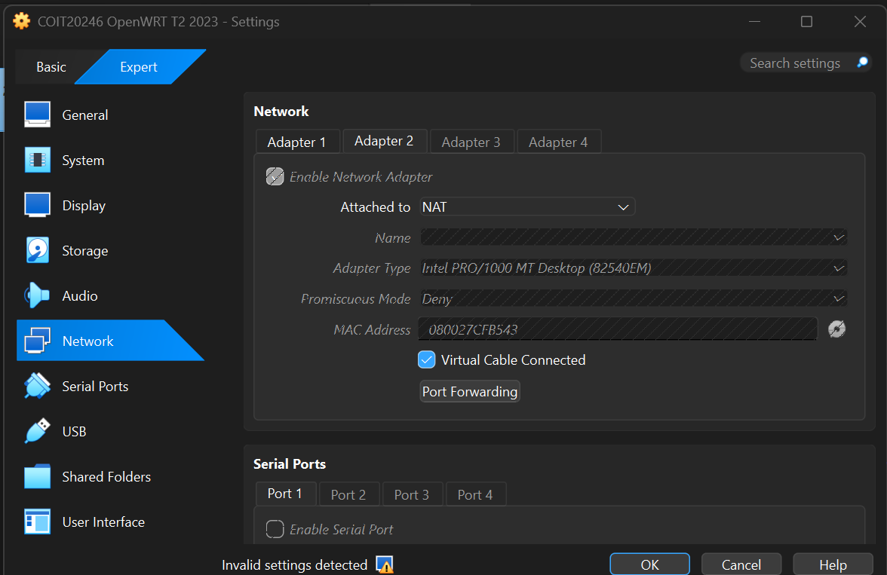

- The management network that was used to connect Windows and OpenWRT was realized through VirtualBox Adapter 1 and the Host-only Adapter.
- VirtualBox Adapter 2 was set up as NAT, thus enabling OpenWRT to access the outside as necessary.
- All OpenWRT interface addresses verified with ip addr command prior to testing.
- A Windows ping of 192.168.56.2 saw that he was able to ping OpenWRT.

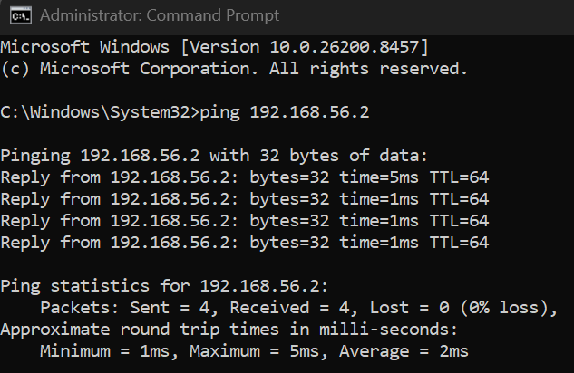

## 3. Test Website Configuration

An OpenWRT was used to create a simple webpage to reflect Harbour Accounting & Tax Solutions. The index.html file was stored in the main website as /srv/www/index.html and was used to open it by accessing the Windows host via binary 192.168.56.2.

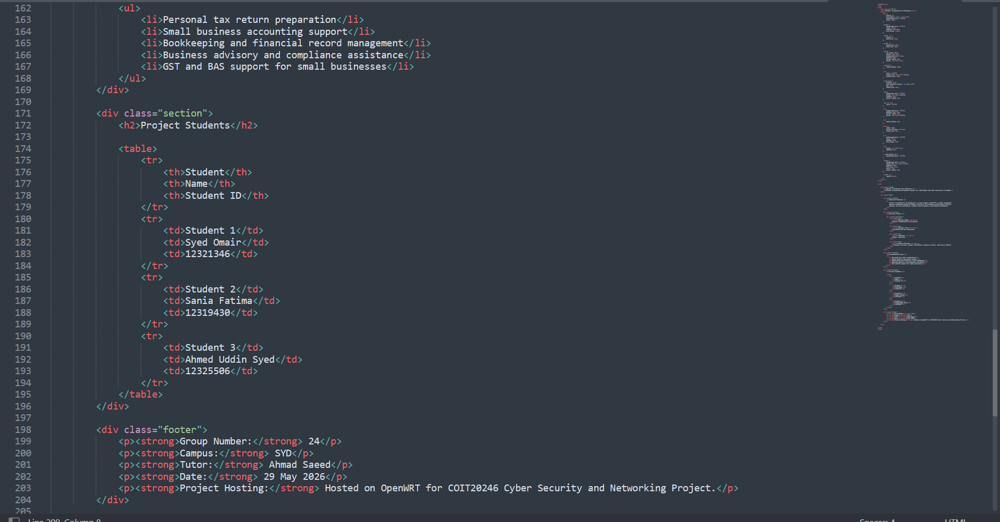

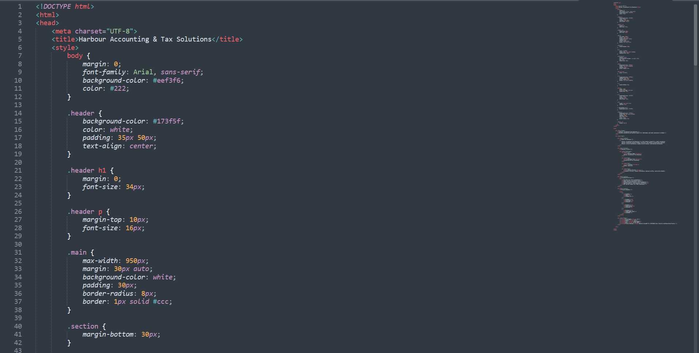

- The site had the business name, business location, the type of business, major services, information about students, group size, campus, tutor, and project date.
- The status of the web server was monitored once the file had been added.

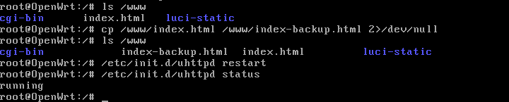

- The main indication of successful browser access was that OpenWRT was properly directing HTTP traffic to the host-only network.

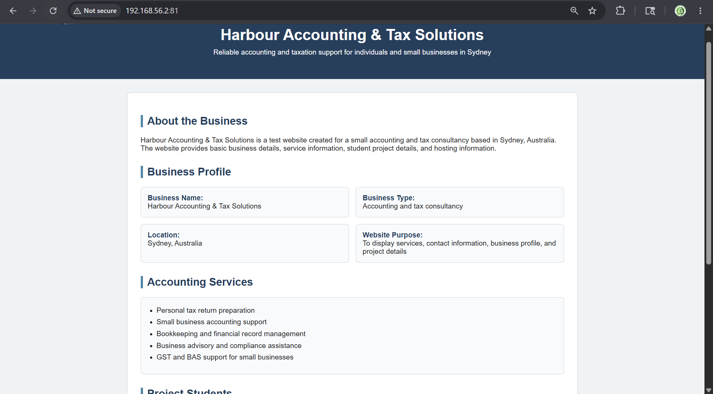

## 4. Lab Network Diagram

The draw.io lab diagram shows the relationship between the Windows host, the VirtualBox host-only network, the OpenWRT VM, NAT connectivity, and the hosted web service. In this design, Windows uses 192.168.56.1/24 and OpenWRT uses 192.168.56.2/24 on br-mng. The NAT-side OpenWRT interface uses 10.0.3.15/24.

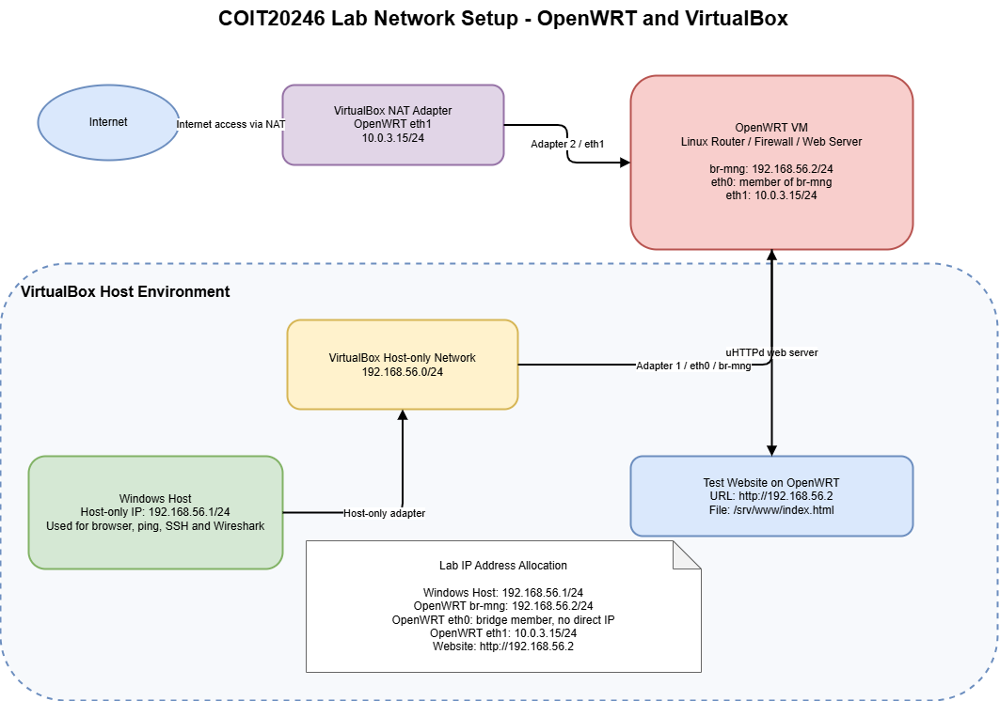

## 5. Firewall Configuration and Testing

The evidence used to test firewall rules was before-and-after. All rules were executed, checked and reverted where needed to ensure that the firewall altered the network behaviour as anticipated.

### HTTP port 80

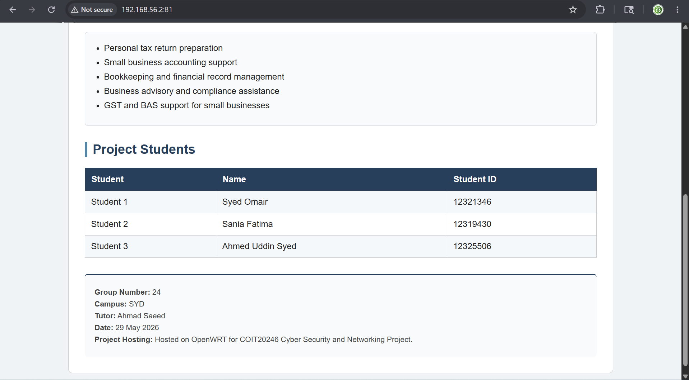

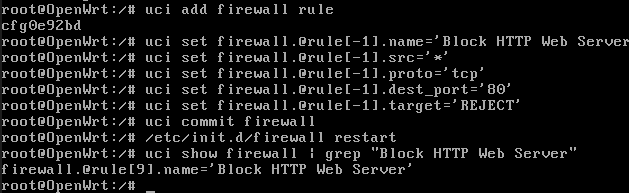

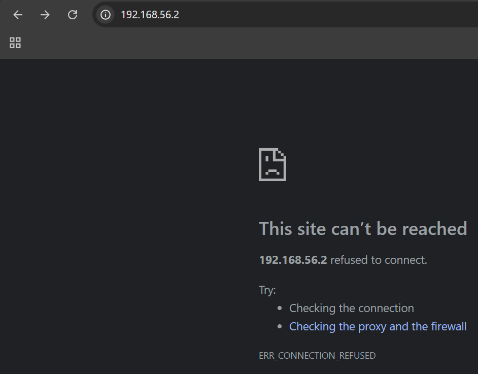

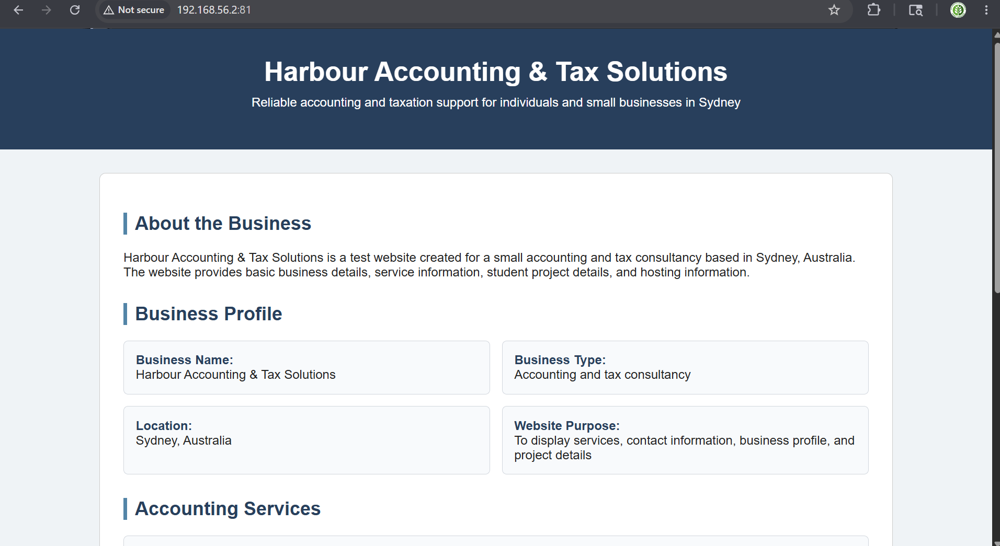

### ICMP ping

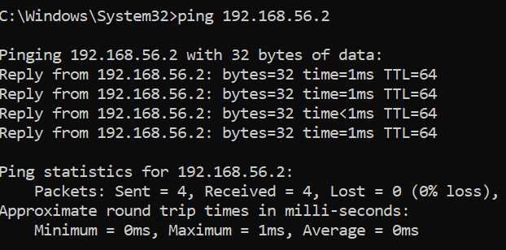

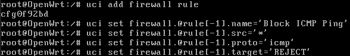

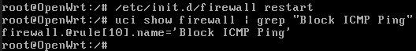

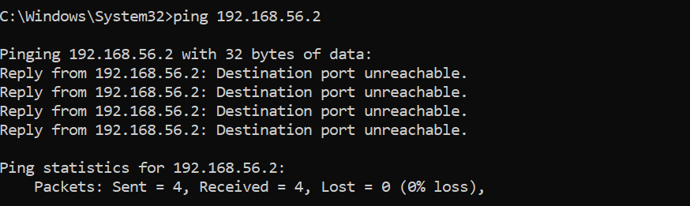

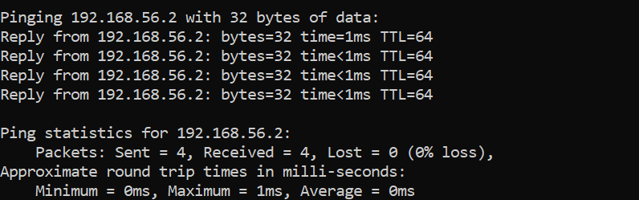

### SSH service

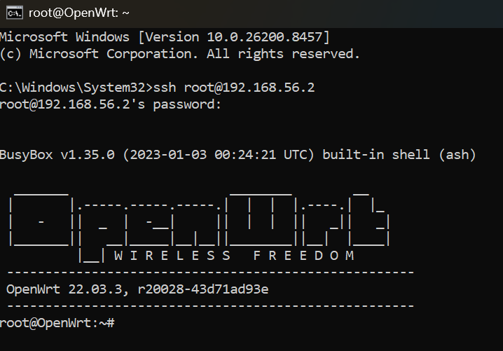

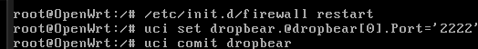

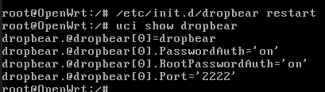

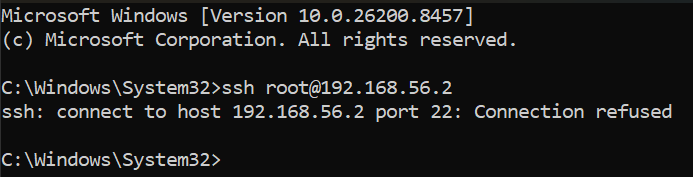

### Management port 81

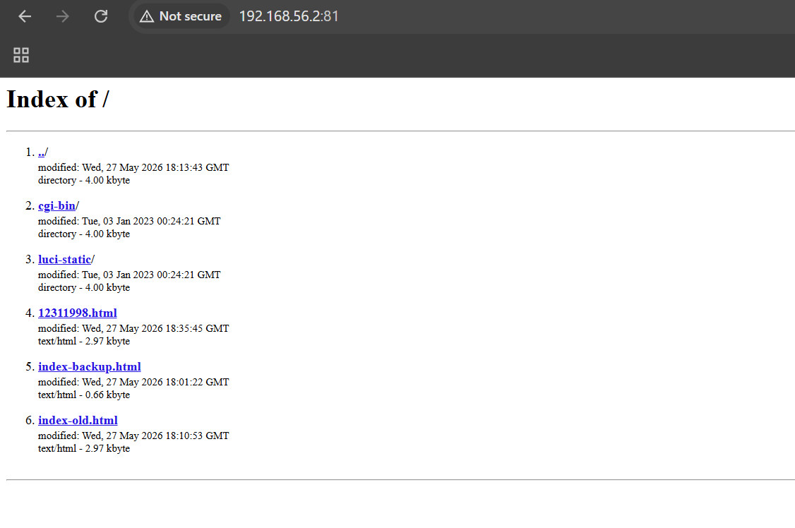

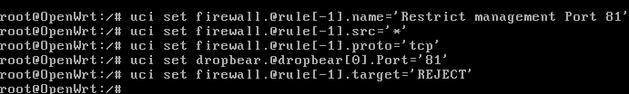

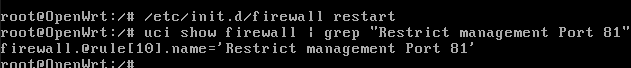

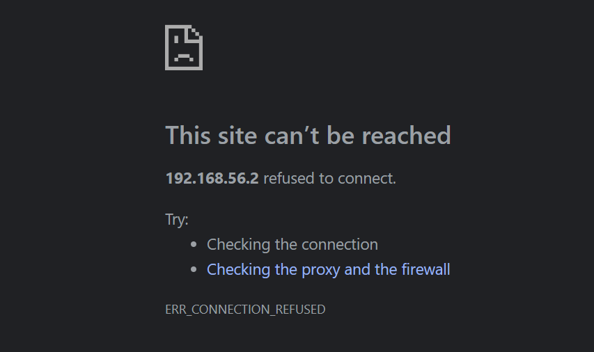

| Test Area | Action Taken | Result | Security Meaning |
|---|---|---|---|
| HTTP port 80 | Blocked web traffic, then allowed it again | Website became unreachable after blocking and loaded again after allowing | Shows that web access can be controlled through firewall filtering |
| ICMP ping | Blocked ICMP and later restored it | Ping failed during the block and succeeded after removal | Reduces basic network discovery but should be enabled when troubleshooting is needed |
| SSH service | Changed SSH from port 22 to port 2222 | Port 22 failed, while ssh -p 2222 connected successfully | Reduces exposure to simple automated scans, but strong passwords or keys are still required |
| Management port 81 | Restricted access to the management interface | Browser access to port 81 was refused | Protects router/firewall administration from unauthorised users |

- Keep only required ports open and block unnecessary services by default.
- Use trusted management hosts or a dedicated management network for router administration.
- Use SSH keys or strong credentials because changing ports alone is not complete security.
- Keep screenshots or command outputs as evidence for each configuration change.

## 6. Production Network Design

The production design demonstrates the way same concept may be implemented into a real small business. The production network (in contrast with the VirtualBox lab) strongly differentiates internal staff equipment with external equipment on the Web Site by the means of Staff LAN and Web Server DMZ.

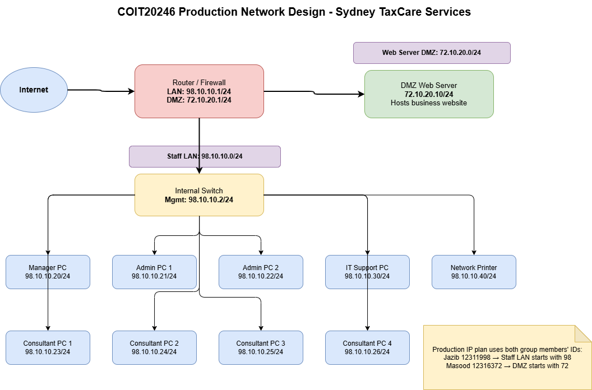

| Network Area | Subnet | Main Devices | Purpose |
|---|---|---|---|
| Staff LAN | 98.10.10.0/24 | Manager PC, admin PCs, consultant PCs, IT support PC, switch, and printer | Internal business work and staff-only resources |
| Web Server DMZ | 72.10.20.0/24 | DMZ web server | Hosts the business website separately from staff systems |
| Router/Firewall | 98.10.10.1 and 72.10.20.1 | LAN and DMZ gateway interfaces | Controls traffic between the internet, staff LAN, and DMZ |

| Device | IP Address | Purpose |
|---|---|---|
| Router/firewall LAN | 98.10.10.1/24 | Default gateway for staff LAN |
| Internal switch management | 98.10.10.2/24 | Switch management |
| Manager workstation | 98.10.10.20/24 | Manager system |
| Administration PCs | 98.10.10.21-22/24 | Administration work |
| Consultant PCs | 98.10.10.23-26/24 | Accounting and client service tasks |
| IT support workstation | 98.10.10.30/24 | Technical support and administration |
| Network printer | 98.10.10.40/24 | Office printing |
| Router/firewall DMZ | 72.10.20.1/24 | Default gateway for web server DMZ |
| Web server | 72.10.20.10/24 | Hosts the Harbour Accounting & Tax Solutions website |

## 7. Added Security Improvements

The original setup can be improved further with a few small business security controls:

- Apply a default-deny firewall approach and only allow business-required traffic.
- If possible, segment staff systems, printers, and servers so as to minimize lateral movement.
- Enforce secure admin access using SSH keys, restricted mgmt IPs and frequently changing passwords.
- Allow the logging of blocked traffic to allow for the review of the traffic if suspect access attempts are made.
- Periodically apply updates of Patch OpenWRT and server packages to mitigate known vulnerabilities.
Make backups of configuration files before clear changes and/or major changes to SSH or firewall setup..

## 8. Conclusion

A small business network can be successfully demonstrated in the lab with OpenWRT and VirtualBox. The Windows host could connect to the OpenWRT and access the stored Harbour Accounting & Tax Solutions website, and check for changes that had been made as a result of changes to firewall rules. The production design involves creating a separation between the internal Staff LAN, and the Web Server DMZ to provide host protection to the business' workstations, while maintaining website operation and ensuring the Public Network receives adequate protection.
